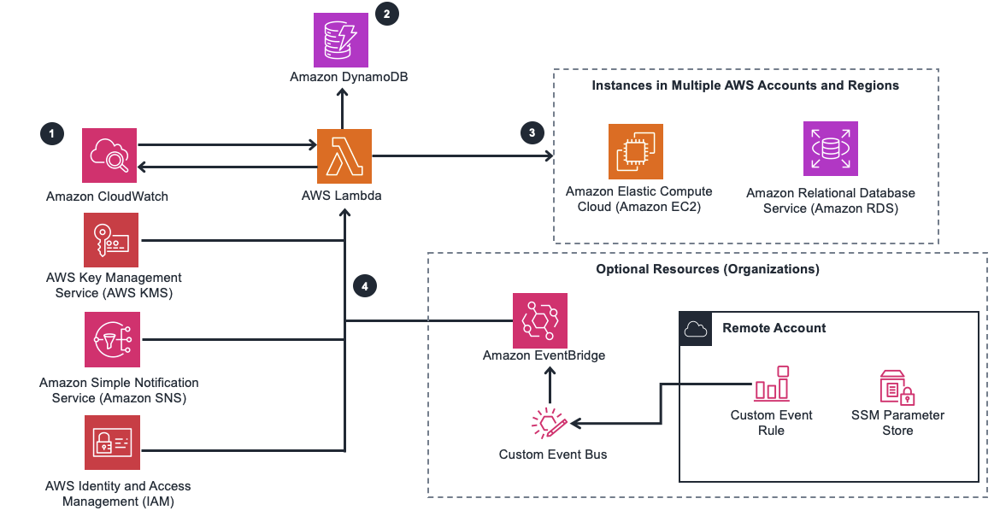

# Automate starting and stopping AWS instances

The Instance Scheduler on AWS solution automates the starting and stopping of Amazon Elastic Compute Cloud (Amazon EC2) and Amazon Relational Database Service (Amazon RDS) instances.

Instance Scheduler on AWS leverages Amazon Web Services (AWS) resource tags and AWS Lambda to automatically stop and restart instances across multiple AWS Regions and accounts on a customer-defined schedule. This solution also allows you to use hibernation for stopped Amazon EC2 instances.

**AWS Architecture diagram**

## Step 1:
1. Go to this [Link](https://us-east-1.console.aws.amazon.com/cloudformation/home).
2. Give Stack Name 
3. Create a stack with default setting, It contains 3 steps.
4. After Submit it will will create dynamoDb table, some IAm roles, Lambda Function ,setup KMS ans SNS and all the stuff internally mentioned in document 

## Step 2: Configure Periods
1. Go To DynaomoDb.
2. You Can See Tables Created during Step 1 in Tables Section.
3. Select Table having name like config and then select **Explore Tables items**
4. Select record with type: **"period"** and name: **"office-hours"** and update it accordingly.
5. After that select **schedule** record having ref: of **office-hours** and name is **settle-office-hours**

After this Steps go To Your instance and create New Tag **Schedule** And Value will be the schedule record of dynamoDb Table in our case it is  **seattle-office-hours**.

**NOTE:** To Delete all the stuff Just delete your stack.